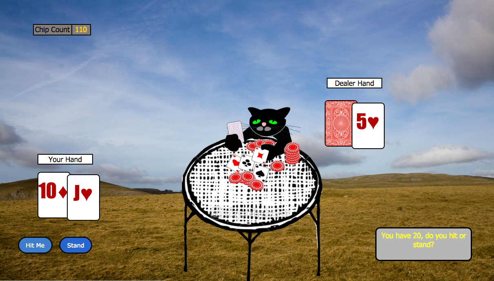

# Browser Blackjack
## By [Yuriy Turetskiy](https://github.com/yuriyt2)

### Purpose
+ A single-player JavaScript blackjack browser game.

### Features
+ Players can play hands of Blackjack against a dealer.
+ Player starts with 100 chips.
+ Dealer will automatically hit until 17.
+ Scoring: 
  + -10 chips when the dealer wins (or player busts) 
  + +10 chips when they beat the dealer 
  + +15 chips for blackjack (unless the dealer also has blackjack)  
  +  No change in the event of a split.

### Technology Used
+ Javascript
+ jQuery
+ HTML
+ CSS

### Play

[Browser Blackjack](http://yuriygame.bitballoon.com)
